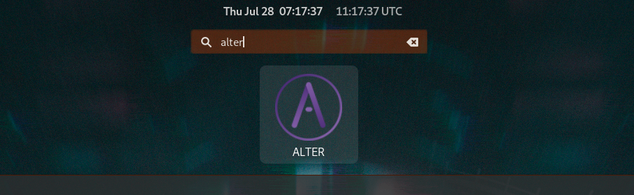
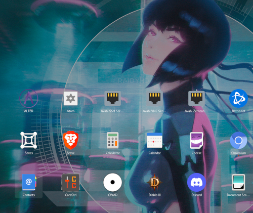
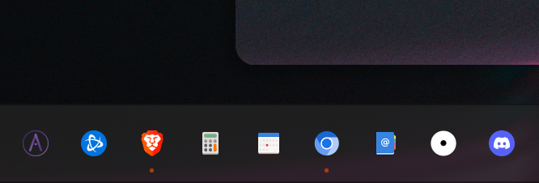
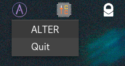

# ALTER_desktop  
  
Create an unofficial [ALTER](https://altermail.live/) desktop application by wrapping with [`nativefier`](https://github.com/nativefier/nativefier).  
  
Feel free to message me after installing and logging in to test it out: `az4jnb2ngz`  
  
GNOME users may need to modify their settings to get the System Tray to work, depending on your GNOME version.  
  
#### Search for ALTER:  

  
  
#### Find ALTER in your applications list  

  
  
#### Pin ALTER to your Dash

  
  
#### Use ALTER on your desktop with ease

   

  
  
#### Utilize the System Tray to hide ALTER when not in use

  
  
## snap  
#### linux-x64  
##### Installs `nativefier` using `snap` and wraps ALTER to an "app"
`cd ~`  
`git clone https://github.com/reversesigh/alter_desktop.git`  
`cd alter_desktop`  
`chmod +x snap_install-linux-x64.sh`  
`./snap_install-linux-x64.sh`  
  
## npm  
#### linux-x64  
##### Installs `nativefier` using `npm` and wraps ALTER to an "app"  
`cd ~`  
`git clone https://github.com/reversesigh/alter_desktop.git`  
`cd alter_desktop`  
`chmod +x npm_install-linux-x64.sh`  
`./npm_install-linux-x64.sh` 
