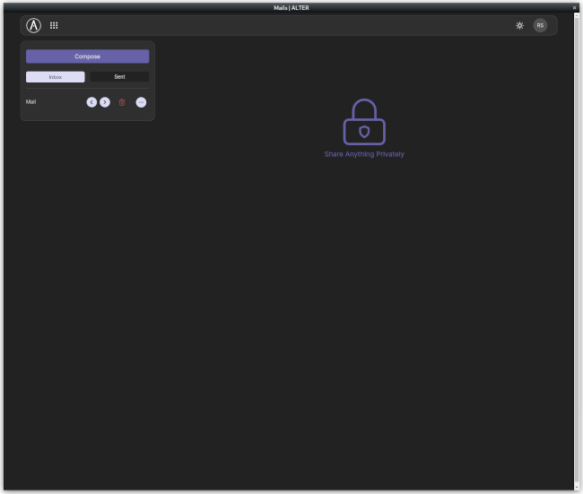

ALTER_desktop
  
Create an unofficial [ALTER](https://altermail.live/) Linux desktop application using [`nativefier`](https://github.com/nativefier/nativefier). This is intended to make it easy for ALTER users to have a desktop instance of ALTER without worrying about creating their own desktop entry. Scripts currently work with Linux distributions. 
  

   

  
  
## snap
`cd ~`  
`git clone https://github.com/reversesigh/alter_desktop.git`  
`cd alter_desktop`  
`chmod +x snap_install.sh`  
`./snap_install.sh`  
  
## npm
`cd ~`  
`git clone https://github.com/reversesigh/alter_desktop.git`  
`cd alter_desktop`  
`chmod +x npm_install.sh`  
`./npm_install.sh` 
