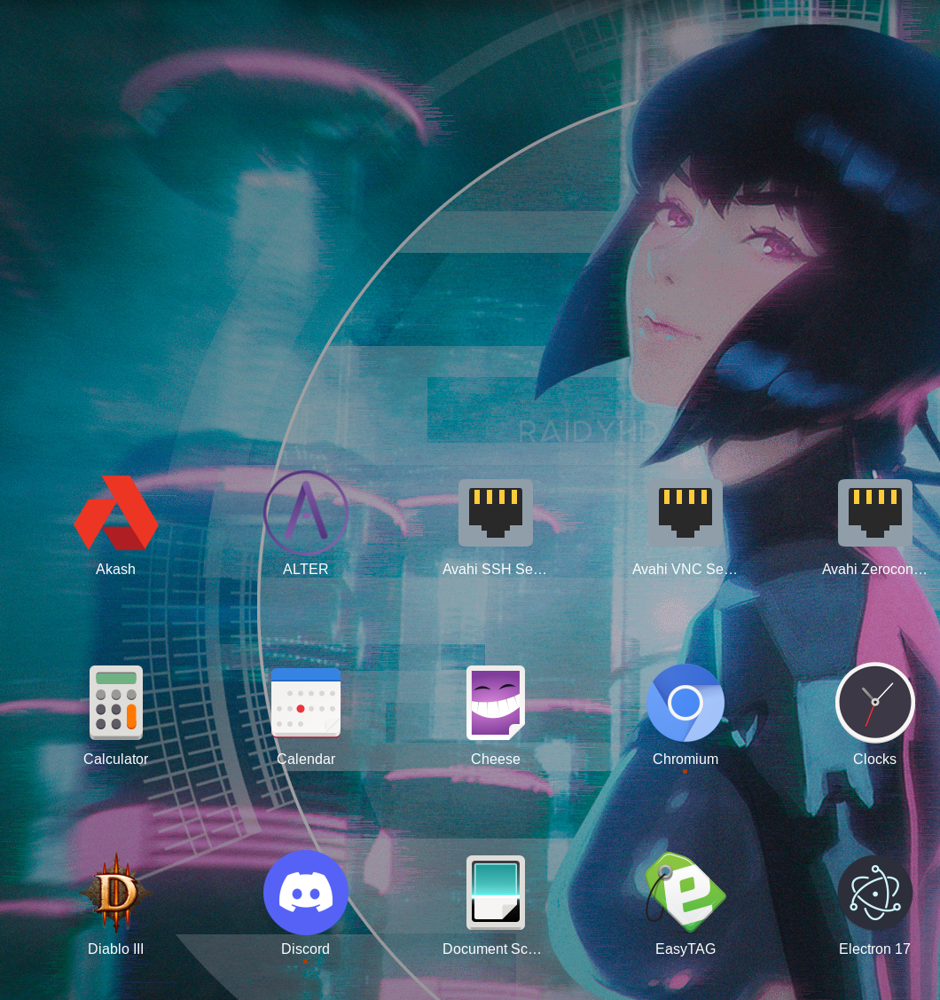

# ALTER_desktop  
Unofficial Nativefier desktop app for [ALTER](https://altermail.live/) private messaging service. Currently only supported for linux-x64
____________________  
  
#### 1. Install npm  & Nativefier
###### Skip if you have `npm` already installed  
##### Debian / Ubuntu  
`sudo apt install npm`  
`npm install nativefier` (or use your preferred settings)
##### CentOS / RHEL / Fedora  
`sudo dnf install npm`  
`npm install nativefier` (or use your preferred settings)
##### Arch / Manjaro
`sudo pacman -S npm`  
`npm install nativefier` (or use your preferred settings)
##### OpenSUSE  
`sudo zypper install npm`  
`npm install nativefier` (or use your preferred settings)
  
____________________  
  
 #### 2. Install ALTER_desktop
`git clone https://github.com/reversesigh/alter_desktop.git`  
`cd alter_desktop`  
`chmod +x build && ./build`  
  
____________________  
  
#### 3. For GNOME users. Install Tray Icons: Reloaded shell extension  
[GNOME Extensions - Tray Icons: Reloaded](https://extensions.gnome.org/extension/2890/tray-icons-reloaded/)  
  
____________________
  
# Summary  
Create an unofficial [ALTER](https://altermail.live/) desktop application by wrapping with [`nativefier`](https://github.com/nativefier/nativefier).  
  
Feel free to message me after installing and logging in to test it out: `az4jnb2ngz`  
    
____________________  
    
#### Search for ALTER:  

  
  
#### Or find ALTER in your applications list  

  
  
#### Pin ALTER to your Dash

  
  
#### Use ALTER on your desktop with ease

   

  
  
#### Utilize the System Tray to hide ALTER when not in use

  
